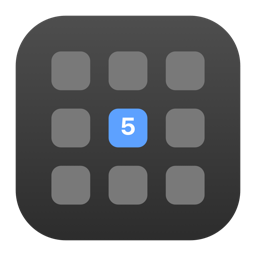
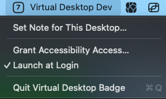
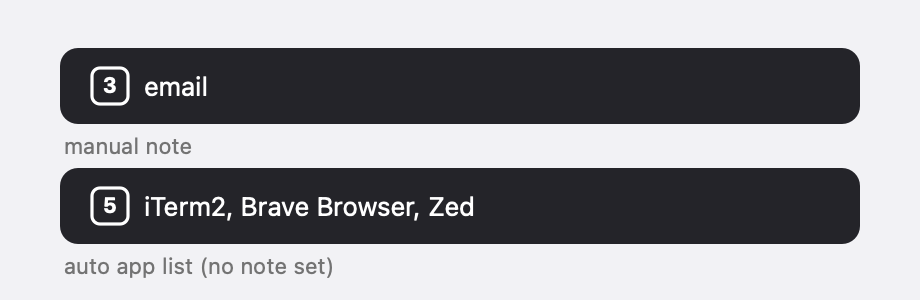

<div align="center">



<h1>Virtual Desktop Badge</h1>

<a href="https://github.com/mr-sk/virtualdesktopbadge/actions/workflows/ci.yml"></a>
<a href="https://github.com/mr-sk/virtualdesktopbadge/releases/latest"></a>

<a href="https://github.com/mr-sk/virtualdesktopbadge/releases"></a>

</div>

A tiny macOS menu-bar app that shows **which desktop (Space) you're on** as a number in a small box. No Dock icon, no window — just the number.

macOS has keyboard shortcuts to jump between desktops (`ctrl+1`, `ctrl+2`, …) but gives no on-screen indication of which one you're currently on. Virtual Desktop Badge fills that gap.



## Download

Grab the latest `VirtualDesktopBadge.zip` from the [**Releases**](https://github.com/mr-sk/virtualdesktopbadge/releases/latest) page, unzip it, and move **VirtualDesktopBadge.app** to `/Applications`.

The app is ad-hoc signed (not notarized), so macOS blocks it on first launch. Allow it once with either:

- Right-click the app → **Open** → **Open**, or
- `xattr -dr com.apple.quarantine /Applications/VirtualDesktopBadge.app`

Prefer to build it yourself? See [Build & Install](#build--install).

## Features

- **Boxed number** in the menu bar showing the current desktop.
- **Instant updates** when you switch with `ctrl+1` … `ctrl+0` (desktops 1–10); higher desktops update via the system read.
- **Self-correcting** after trackpad swipes / Mission Control, via the system space-change notification.
- **Multi-monitor aware** — always tracks your **primary** (menu-bar) display, and re-reads when you dock/undock.
- **Per-desktop labels** beside the number: a manual note you set, or — if you haven't — the **apps currently on that desktop**, updated live.
- **Launch at Login** toggle and **Quit** in a click menu.

## Requirements

- macOS 13 (Ventura) or later
- Xcode command-line tools / Swift 5.9+ (to build)

## Build & Install

```bash
# Build, bundle, and ad-hoc sign into build/VirtualDesktopBadge.app
./scripts/package_app.sh

# Install it (optional but recommended — Launch at Login is more reliable from /Applications)
cp -R build/VirtualDesktopBadge.app /Applications/

# Launch
open /Applications/VirtualDesktopBadge.app
```

`package_app.sh` also generates the app icon and ad-hoc signs the bundle, so no Xcode project is needed.

**Launch at login** can be enabled from the menu (**Launch at Login**), or headlessly:

```bash
/Applications/VirtualDesktopBadge.app/Contents/MacOS/VirtualDesktopBadge --register-login
```

### First launch: grant Accessibility access

The `ctrl+N` instant path uses a global key monitor, which macOS gates behind **Accessibility** permission. On first launch Virtual Desktop Badge prompts for it:

1. **System Settings → Privacy & Security → Accessibility** → enable **Virtual Desktop Badge**.
2. **Quit and relaunch** the app (the permission only takes effect on a fresh launch).

You can reopen this pane any time from the menu: **Grant Accessibility Access…**

> Without the grant, the badge still updates on trackpad/Mission Control switches (that path needs no permission) — only the keyboard-shortcut path is affected.

## Usage

- Switch desktops however you like; the badge follows.
- **Labels:** beside the number, Virtual Desktop Badge shows a label for the current desktop:
  - a **manual note** if you've set one (e.g. `email`, `deep work`), or
  - otherwise the **apps currently on that desktop** (frontmost first, up to 3 then `+N`), updated live as you open and close them.

  

- Click the badge for the menu:
  - **Set Note for This Desktop…** — type a note for the current desktop (blank clears it; a note overrides the auto app list).
  - **Grant Accessibility Access…** — opens the relevant Settings pane.
  - **Launch at Login** — start Virtual Desktop Badge automatically (toggles a checkmark).
  - **Quit Virtual Desktop Badge**

## How it works

macOS exposes **no public API** for "what Space number am I on," so Virtual Desktop Badge uses a hybrid of two signals:

1. **Keyboard (instant, no private API):** a global monitor watches for `ctrl`+digit by *physical key code* (layout-independent) and sets the number immediately.
2. **System notification + private API (always correct):** `NSWorkspace.activeSpaceDidChangeNotification` fires on any switch, including swipes. Virtual Desktop Badge then re-derives the true number from the private `CGSCopyManagedDisplaySpaces` API for the **primary** (menu-bar) display — so the number is correct at rest regardless of where the mouse or focus is.

The private API is **isolated to a single file** (`Sources/virtualdesktopbadge/CGSBridge.swift`). If a future macOS changes it, only that file needs attention — and the keyboard path keeps working regardless.

## Project layout

```
Sources/
  VirtualDesktopBadgeCore/        # pure, unit-tested logic (no system calls)
    DisplaySpaces.swift   # parse raw CGS data → typed model
    SpaceIndex.swift      # map active space → 1-based desktop number
    SpaceTracker.swift    # current-number state + change callback
    BadgeRenderer.swift   # number → menu-bar image
    NoteStore.swift       # per-desktop manual notes (persisted)
    AppLabel.swift        # format the desktop's app list for the menu bar
  virtualdesktopbadge/            # AppKit executable (the system glue)
    main.swift            # NSApplication bootstrap (.accessory agent)
    AppDelegate.swift     # status item, key monitor, notification, menu
    CGSBridge.swift       # the one file touching the private API
    ScreenInfo.swift      # primary display UUID
    DesktopApps.swift     # apps with windows on the current desktop
Tests/
  VirtualDesktopBadgeCoreTests/   # XCTest coverage of the pure core
scripts/
  package_app.sh        # build + assemble + sign the .app bundle
  make_icon.swift       # render the app icon (.iconset) for packaging
```

## Development

```bash
swift build      # compile
swift test       # run the unit tests (the VirtualDesktopBadgeCore logic)
```

The pure logic lives in `VirtualDesktopBadgeCore` precisely so it can be tested without a GUI; the executable target is thin wiring around it.

## Limitations

- The instant keyboard path covers `ctrl+1` … `ctrl+0` (desktops 1–10, the number-row keys). Higher desktops still display correctly via the notification/swipe path — just without the zero-lag shortcut.
- Auto app-labels only reflect the desktop you're currently viewing; macOS doesn't expose the windows on desktops you aren't looking at (which is all the badge needs).
- The Space-number derivation relies on a private, undocumented macOS API; it may need updating on major macOS releases.

## License

An idea and project brought to you by **sk** from [skheavyindustries.com](https://skheavyindustries.com).

Always welcome to feedback & improvements!
